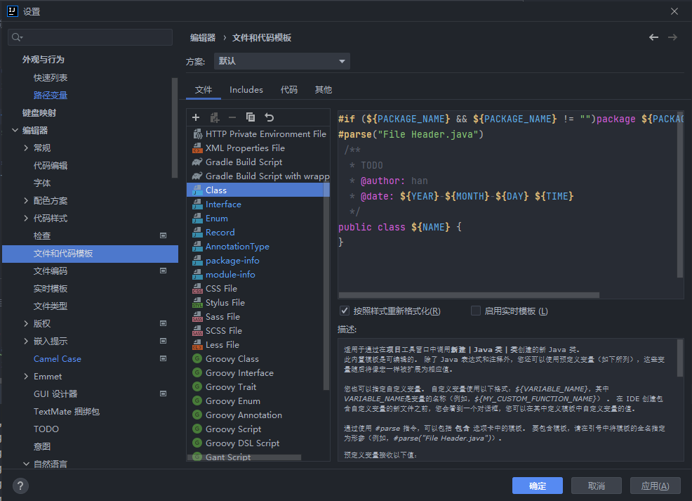

# idea_setting

## 简介

​		此仓库是用于IDEA的备份，这里有我平时开发中觉得好用的配置及插件，现在将这些配置和插件同步至GitHub，有需要的朋友可以直接拉取使用。

**版本及电脑配置信息：**

1. Windows 10
2. 内存16GB
3. IntelliJ IDEA 2021.3.3 (Ultimate Edition)

> 配置仅供参考，有问题可以联系本人修改。

##  设置包含

1. 在新窗口打开工程


2. 关闭IDEA自动更新（个人不喜欢更新太频繁）


3. Maven本地仓库位置


4. 自动导包优化


5. 文件编码设置（非常重要）


6. Maven本地仓库及配置文件设置


7. 文档注释当然是少不了啦（根据自己的需要修改）



8. 方法注释


> 附上了找了许久的注释脚本，找了许多博客，tmd好多都是有问题的，这个也有点点瑕疵，但是问题不大！

```groovy
groovyScript("def result = '';def params = \"${_1}\".replaceAll('[\\\\[|\\\\]|\\\\s]', '').split(',').toList(); for(i = 0; i < params.size(); i++) {if(params[i] != '')result+='* @param ' + params[i] + ((i < params.size() - 1) ? '\\r\\n ' : '')}; return result == '' ? null : '\\r\\n ' + result", methodParameters())
```

9. 还有更新详细的配置，以上是我安装idea必配置的内容。其它配置可参考：https://blog.csdn.net/qq_37242720/article/details/119349394

## 必装插件


- Alibaba Java Coding Guidelines

  - 阿里开发的代码检查插件
  - 优化自己的代码，养成良好的代码习惯
  - 有些人写的代码真的看都不想看，就是一坨翔。

- Camel Case

  - 各种驼峰命名转换
  - 快捷键是：`Shift + Alt + U`

- Grep Console

  - 控制台彩色展示，更新清楚的查看控制台

- chapter_reader

  - 摸鱼神器
  - 看小说
  - 在左下方，非常隐蔽

  

- Code Glance pro

  - 代码缩略图
  - idea自带的不好用

  

- Chinese Language Pack

  - 中文语言包
  - 英语不好的朋友可以装一个

- JRebel JRebel and XRebel

  - 热部署插件

- JRebel mybatisPlus extension

  - 对Jrebel不能热部署静态文件的扩展插件

- Maven Helper

  - 解决依赖冲突的神器，可以查看哪些依赖有冲突，自动或手动解决

- MyBatisx

  - 映射方法与XML之间的跳转


- Tanslaition
  - 翻译插件，支持划词翻译，翻译文档注释


```

```

